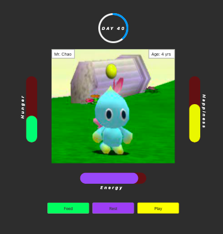

# Chagotchi

This game is my take on the classic *Tamagotchi* game!

Watch your chao enjoy the days growing up in *Chao Garden* along with its buddies!

## Objective
 Try to keep your chao alive during this fast paced version. The goal is to keep the *Hunger*, *Energy* and *Happiness* bars from **hitting 10**; by pressing the corresponding buttons. However, do not over press the buttons or you will **kill your chao!**

##  User Stories

1. User enters their Chao's name into the prompt to begin.

2. Game timer starts!

3. Hunger, Energy and Happiness emojis will change as the gauges increase.

- Hunger:  😋 1- 3
🤤 4-6
😖 7-9

- Energy: 🤩 1-3
🥱 4-6
😪 7-9

- Happiness: 🤪 1-3
😥 4-6
😭 7-9

- **Game over**: -1 or 10 ☠️

4. User clicks button to decrease corresponding gauge by 1.

- 🍎 Feed
- 🛏 Rest
- 🧸 Play

5. User must not overclick at 0 or game over.

6. User keeps up with gauges to age up.

7. Days in the garden add up.

8. **User should have fun and see how long they can keep their chao alive!** 🎉

## Wireframe

